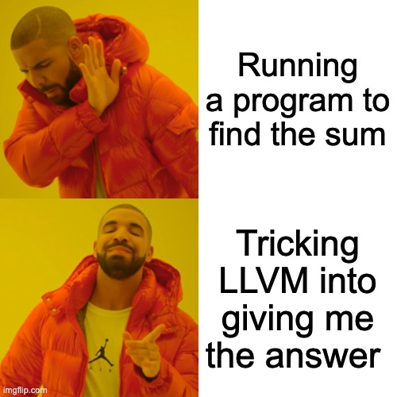

# Just give me the .exe you smelly nerd![^1]

[^2]

```rs
fn my_sum() -> u32 {
    (0..1000).sum() // [0,999]
}
```

```sh
# has to both compile and run!
# we've got to save them clock cycles!
cargo run
```

```sh
# only compiles, much better
cargo rustc -- --emit asm
```

```asm
_my_sum:
    sub   sp, sp, #32
    stp   x29, x30, [sp, #16]
    add   x29, sp, #16
    str   wzr, [sp, #8]
    mov   w8, #1000
    str   w8, [sp, #12]
    ldr   w0, [sp, #8]
    ldr   w1, [sp, #12]
    bl    __ZN4core4iter6traits8iterator8Iterator3sum17h8cc173ee33db684aE
    ldp   x29, x30, [sp, #16]
    add   sp, sp, #32
    ret
```


```sh
# ask rustc for the answer really nicely
cargo rustc --release -- --emit asm
```

```asm
; much better

my_sum:
  mov   w0, #40748 
  movk  w0, #7, lsl #16
  ret
```

```asm
my_sum:
  mov    w0, #40748 
  movk   w0, #7, lsl #16
  ;       ^   ^   ^
  ;       |   |   |- left shift 16 bits
  ;       |   |- immediate 7
  ;       |- dest word register
  ;
  ;       7 = 0000000000000000111
  ; 7 << 16 = 1110000000000000000
  ;   40748 = 0001001111100101100
  ;    or'd = 1111001111100101100
  ;
  ; (7 << 16) | 40748
  ; im not a computer person though so idk what that equals
  ; also why tf doing these ops?

  ret
```

ARM uses fixed sized 32 bit instructions which includes _all the operands and the instruction itself_. This means we can never encode a full 32 bit number as an immediate value in ARM assembly. The max possible encoded size can actually depend on the instruction being executed even. So using immediate values over a certain size requires a little shifting dance or even adding bits into the lower and upper halves of registers separately.

On x86 Apple Intels

```sh
# ask rustc really, really nicely
cargo rustc --target x86_64-apple-darwin --release -- -C opt-level=3 --emit asm
```

```asm
my_sum:
  pushq   %rbp
  movq    %rsp, %rbp
  movl    $499500, %eax
  popq    %rbp
  retq
```

On x86 Intel

```sh
# ask rustc really, really, really nicely
# need a new linker and target arch
cargo rustc --release --target x86_64-unknown-linux-musl -- -C linker=x86_64-linux-musl-gcc -C opt-level=3 --emit asm
```

```asm
my_sum:
  mov  eax, 499500
  ret
```

Ultimate no code solution?

S/o to [godbolt](https://godbolt.org/), the best compiler exploration tool on earth.

Closed form sum (Gauss Summation): $\sum^n_{i=1}{i} = \frac{n (n-1)}{2}$

[^1]: <https://www.reddit.com/r/github/comments/1at9br4/i_am_new_to_github_and_i_have_lots_to_say/>
[^2]: [_How LLVM Optimizes Geometric Sums_](https://kristerw.blogspot.com/2019/04/how-llvm-optimizes-geometric-sums.html) by GCC dev Krister Walfridsson.
